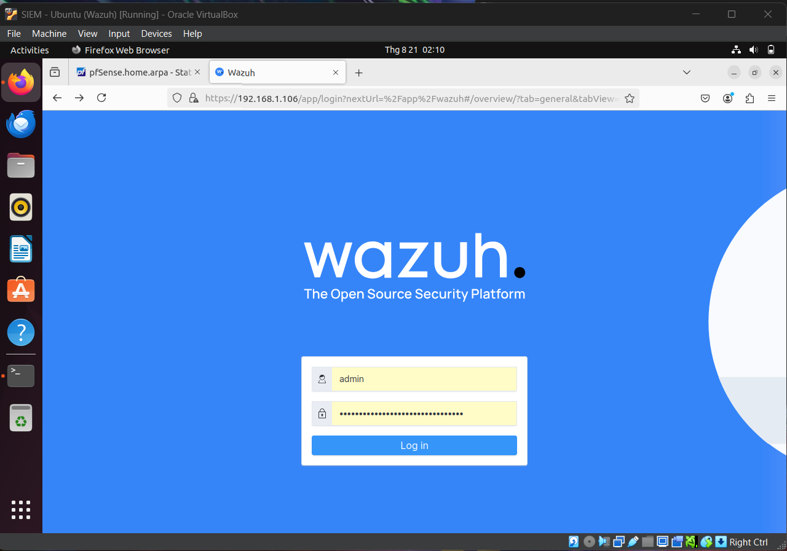
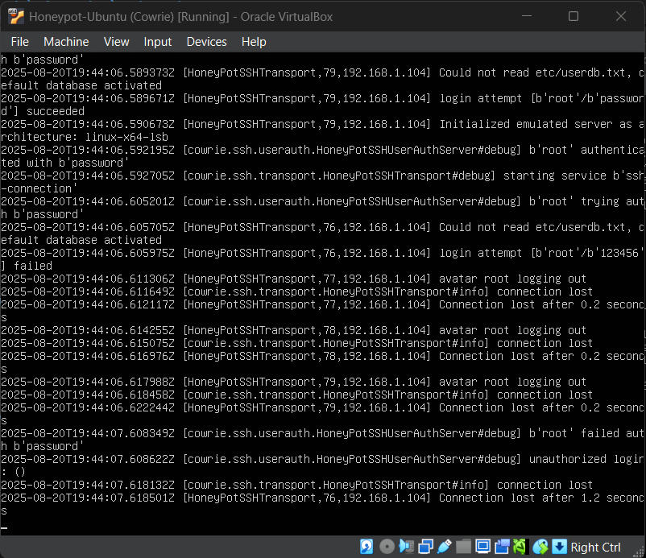

# 🖥️ SOC-in-a-Box (5 Virtual Machines Lab)

Một project cá nhân nhỏ về **Security Operations Center (SOC)** gồm 5 thành phần chính: **Attacker, Firewall, IDS, Honeypot, và SIEM**.  
Dự án được thực hiện nhằm có cái nhìn tổng quan hơn về sự đối lập **Red Team vs Blue Team** trong vận hành hệ thống.

--- 

## 🎯 Mục tiêu học tập
Thông qua dự án lab này, mình tích lũy được:
- 🔍 **Trinh sát & khai thác (Red Team)**
- 🛡️ **Phát hiện & giám sát (Blue Team)**
- 📊 **SIEM phân tích log & cảnh báo**

---

## 📖 Kịch bản chính
1. **Attacker** vượt qua Firewall và quét dải mạng nội bộ bằng **Nmap**.  
2. Sau đó, Attacker brute force **SSH** của Honeypot bằng **Hydra**.  
3. Khi khai thác thành công, Attacker thực thi một số command (`ls`, `cat /etc/passwd`, …).  
4. Ở phía phòng thủ:  
   - **IDS** phát hiện quét mạng.  
   - **Honeypot** ghi log toàn bộ quá trình Attacker thao tác trên Honeypot.  
   - **SIEM** tập trung log và cảnh báo cho Admin.  

---

## 📡 Sơ đồ hệ thống


> **Lưu ý**: Trong thực tế, Firewall sẽ chặn toàn bộ traffic WAN → LAN. Trong lab, Attacker được đặt trực tiếp trong LAN để tiết kiệm thời gian.

### Một số tình huống thực tế khiến attacker xâm nhập LAN:
- Exploit lỗ hổng firewall/router.  
- Phishing/social engineering.  
- VPN/Remote access yếu kém.  
- Port forwarding/DMZ misconfig.  
- Lỗi cấu hình firewall rule.  

---
## ⚙️ Cấu hình từng máy ảo

### 🔺 1. Attacker VM (Kali Linux)
- **Purpose**: Thực hiện scan, brute force, exploit.  
- **Tools**: `Nmap`, `Hydra`  
- **Specs**: `2 vCPU | 2 GB RAM | 20 GB Disk`  
- **Network**: Internal Network  

---

### 🛡️ 2. Firewall VM (pfSense)
- **Purpose**: Áp dụng firewall rules, forward logs về SIEM.  
- **Features**: NAT, Syslog export  
- **Specs**: `2 vCPU | 2–4 GB RAM | 20 GB Disk`  
- **Network**:  
  - NIC1: WAN (Bridged Adapter)  
  - NIC2: LAN (Internal Network)  

---

### 👁️ 3. IDS VM (Snort)
- **Purpose**: Detect suspicious traffic.  
- **Features**: Signature-based IDS/IPS, log forwarding  
- **Specs**: `2 vCPU | 2–3 GB RAM | 20 GB Disk`  
- **Network**: Internal Network  

---

### 🎣 4. Honeypot VM (Cowrie on Ubuntu)
- **Purpose**: Thu hút attacker, ghi lại command.  
- **Features**: SSH/Telnet honeypot, session logging  
- **Specs**: `1 vCPU | 1–2 GB RAM | 15 GB Disk`  
- **Network**: Internal Network  

---

### 📊 5. SIEM VM (Wazuh All-in-One)
- **Purpose**: Thu thập log, hiển thị dashboard, cảnh báo.  
- **Features**: Log management, dashboards, alerting  
- **Specs**: `2–4 vCPU | 4–6 GB RAM | 40 GB Disk`  
- **Network**: Internal Network  

---

## 🚀 Deployment Guide

> **Lưu ý**: Cả 5 máy phải được cài trên cùng một ứng dụng Virtual Box (hoặc VMWare)

### 1. Chuẩn bị
- VirtualBox hoặc VMware.  
- ISO images:  
  - Kali Linux  
  - Ubuntu Server/Desktop  
  - pfSense   

### 2. Import & cấu hình VM
1. Tạo 5 VM theo specs trên.  
2. Cấu hình mạng:  
   - pfSense cung cấp DHCP cho LAN.  
   - Các VM khác nối vào Internal Network.  

### 3. Cài đặt phần mềm
- **pfSense**: enable Syslog → gửi về Wazuh.  
- **Snort**: bật rules detect scan & brute force → gửi log về Wazuh (Wazuh agent).  
- **Cowrie**: cấu hình output → gửi log về Wazuh (Wazuh agent).  
- **Wazuh**: cài All-in-One → nhận log từ các VM.  

### 4. Kiểm thử
- Từ Kali: chạy `nmap -sn 192.168.1.0/24` và `nmap -p- 192.168.1.103`.  
- Quan sát cảnh báo trong Snort + Wazuh dashboard.  
- Brute force SSH Honeypot bằng Hydra:  
  ```
  hydra -l root -P passwords.txt ssh://192.168.1.103
  ```
- Kiểm tra log session trong Cowrie + alert trên Wazuh.

---
## 📚 References
- [Ubuntu Desktop Installation](https://www.youtube.com/watch?v=TgI8dXuTnos)  
- [Ubuntu Server Installation](https://www.youtube.com/watch?v=T2MMXcTAhe0)  
- [Kali Linux Setup](https://www.youtube.com/watch?v=sAMnXte56yY)  
- [pfSense Setup](https://www.youtube.com/watch?v=Y-Dj8lHmXy8)  
- [Snort IDS](https://www.youtube.com/watch?v=U6xMp-MIEfA)  
- [Cowrie Honeypot](https://www.youtube.com/watch?v=m7ZmwjyhzHU)  
- [Wazuh SIEM](https://www.youtube.com/watch?v=wx-xYDocYXs)  

---

## 📸 Demo (Screenshots) từng máy ảo

### 1. Tổng quan:


Tất cả các máy ảo nằm cùng trong 1 mạng LAN. Nhận IP từ DHCP của pfSense (đóng vai một Router)


> **Chú thích**: sonchan-virtualbox là SIEM Wazuh (do mình đặt tên kém chuyên nghiệp quá hehee)

### 2. Giao diện pfSense - được cài trên Ubuntu Server


### 3. Giao diện Snort - được cài trên Ubuntu Server


### 4. Giao diện Cowrie - được cài trên Ubuntu Server


### 5. Giao diện Wazuh - được cài trên Ubuntu Desktop




### 6. Giao diện Kali Linux


---

## 📸 Demo (Screenshots) từng kịch bản tấn công + phòng thủ

### Kịch bản 1: Kali chạy **nmap** quét mạng → **Snort** cảnh báo có quét mạng.


Ban đầu, Kali quét nmap với chế độ -sn. Snort không có cảnh báo vì chưa đủ độ nghi ngờ.


Tuy nhiên khi Kali quét trực tiếp các port của một IP cụ thể (192.168.1.103 trong hình là Honeypot), Snort sẽ ngay lập tức cảnh báo.


Vì mình đã cấu hình đẩy log từ Snort qua Wazuh nên có thể xem từ Dashboard của Wazuh và phân tích sâu hơn nhờ các công cụ trong Wazuh.


## Kịch bản 2: Kali sử dụng Hydra để tấn công **SSH brute-force** → **Cowrie** ghi lại toàn bộ quá trình Hacker tấn công
Sau khi đã xác định được các port mở trên Honeypot. Attacker tiến hành tấn công bruteforce trên port SSH.


Cowrie ghi lại toàn bộ quá trình bruteforce luôn, bao gồm tất cả các username-password mà Hydra đã thử.



Khi kẻ tấn công đăng nhập vào port SSH và thực thi một số câu lệnh. Cowrie cũng ghi lại toàn bộ gồm cả IP kết nối và các câu lệnh OS đã được thực thi.


Toàn bộ log của Cowrie cũng sẽ được đẩy qua bên Wazuh để Admin có thể tiện theo dõi và phân tích thêm.


---